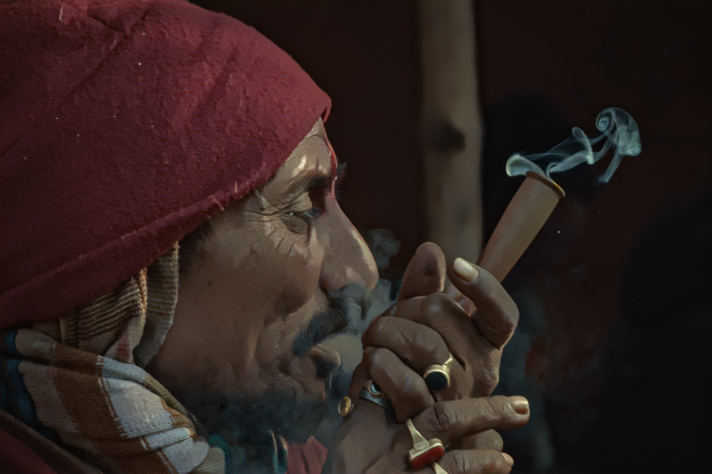
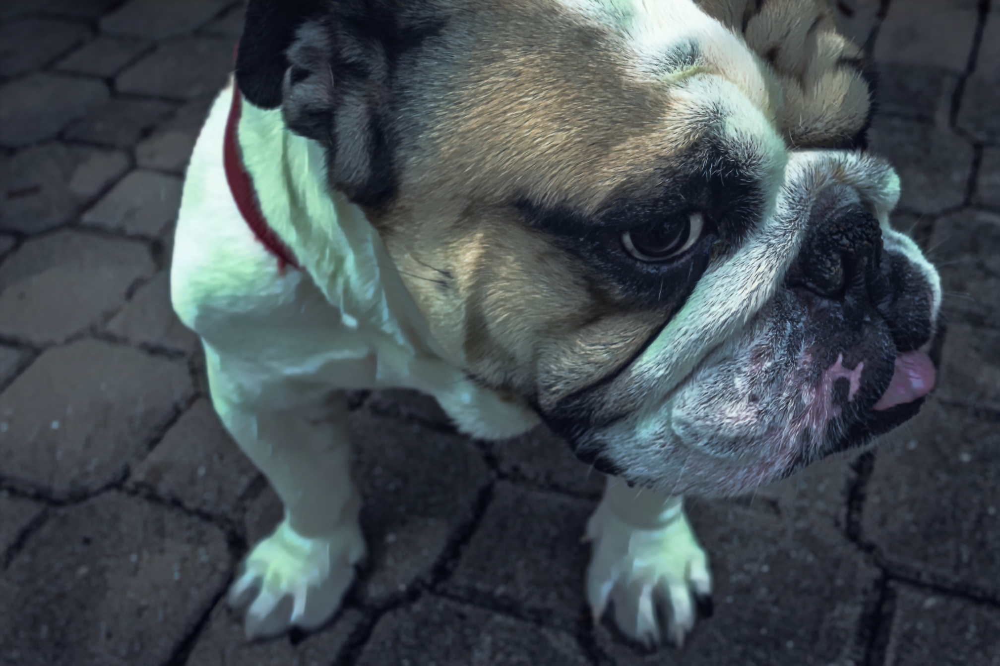
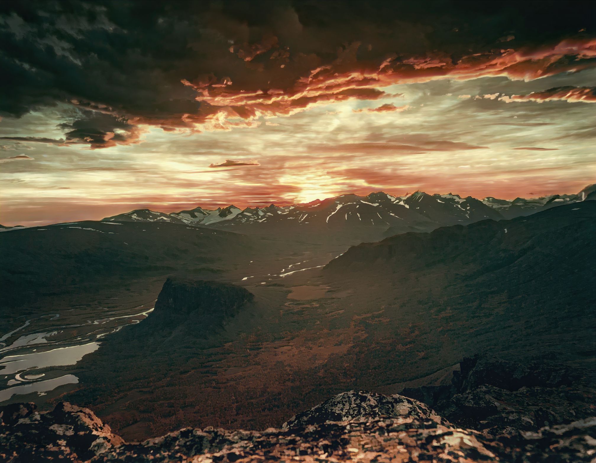
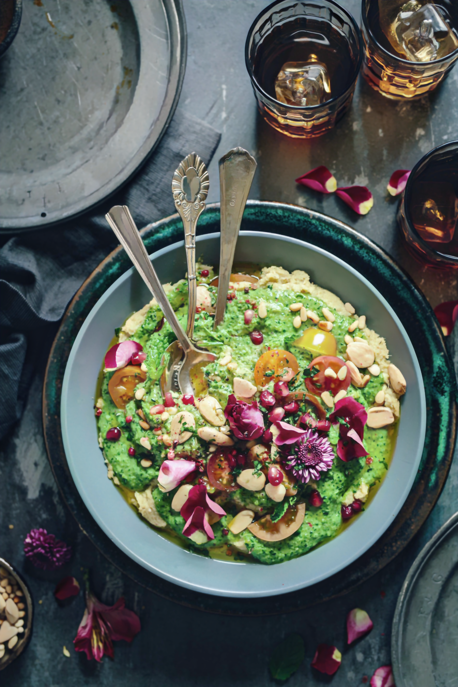

# CartooNet 
## CS484-555 Introduction to Computer Vision Project - Bilkent University
- An improvement project on the [White-Box Cartoonization Paper](https://openaccess.thecvf.com/content_CVPR_2020/papers/Wang_Learning_to_Cartoonize_Using_White-Box_Cartoon_Representations_CVPR_2020_paper.pdf). 
- See the [original repo](https://github.com/SystemErrorWang/White-box-Cartoonization) for the TensorFlow implementation. For ours, we have used the [equivalent repo](https://github.com/zhen8838/AnimeStylized) that implements in PyTorch. For project completeness, we explained how to code is run but you can also check out the [source repository](https://github.com/zhen8838/AnimeStylized). 
 
 ---
 
### Dataset
The dataset is the same dataset that both repositories have used, which can be downloaded from [here](https://drive.google.com/file/d/10SGv_kbYhVLIC2hLlz2GBkHGAo0nec-3/view?usp=sharing). Download dataset and unzip inside the repository. 
The dataset consists of four folders
 - **face_photo**
	 - 10000 RGB face photos of 256x256 resolution.
 - **face_cartoon**
	 - pa_face and kyoto_face each contain 5000 RGB cartoon face images. We use the pa_face for our implementations.
 - **scenery_photo**
	 - 5000 RGB scenery photos of 256x256 resolution.
 - **scenery_cartoon**
	 - Has three folders of 5000 scenery cartoon images of 356x256 resolution each. Each folder's name represents the artists the images are obtained from namely: shinkai (Makoto Shinkai), Miyozaki Hayao (hayao) and Mamoru Hosoda (hosoda). For our implementation, we use shinkai style image transfer. 

---

### Pretrained VGG-19 Model
This implementation uses a pretrained VGG19 model. Download the model from [here](https://drive.google.com/file/d/1wOBtQmcs6SdyEoAu-mrHdqPRBe3gfsJ2/view?usp=sharing) and unzip under a folder called `models` with the name `vgg19.npy`.

---
### Environment
We have used a conda environment to build the prooject with the following commands.

    conda create -n torch python=3.8
    conda activate torch
    conda install pytorch==1.6.0 torchvision==0.7.0 cudatoolkit=10.1 -c pytorch
    pip install pytorch-lightning==1.0.2 opencv-python matplotlib joblib scikit-image torchsummary webdataset albumentations more_itertools
---
### Models 
There are three models that can be run with this repo. Note that all of these models took around 36 hours to train. 

 #### **whitebox**
 
This is the original architecture of whitebox cartoonization. 

**Pretraining**

 `make train CODE=scripts/whiteboxgan_pretrain.py CFG=configs/whitebox_pretrain.yaml`
 
**Training**

Make sure the `pre_trained_ckpt` in `configs/whitebox.yaml` points to the correct .ckpt file e.g. `logs/whitebox_pre/version_0/checkpoints/epoch=1.ckpt`

For training, run:
 `make train CODE=scripts/whiteboxgan.py CFG=configs/whitebox.yaml`
 
To continue from a previous checkpoint run:

 `make train CODE=scripts/whiteboxgan.py CFG=configs/whitebox.yaml CKPT=[path of checkpoint]`
 
 To train silently within a Linux server run:
 
 `nohup make train CODE=scripts/whiteboxgan.py CFG=configs/whitebox.yaml > whitebox.out`
 
 **Inference**
 
 To infer single image, run:
 
 `make infer CODE=scripts/whiteboxgan.py CKPT=[checkpoint path] EXTRA=image_path:[image path]`
 
 where `checkpoint path` is the path of the .ckpt file you want its weights e.g. 
`logs/whitebox/version_3/checkpoints/epoch=19.ckpt` and image path is the path of the image. 

 To infer all images in a directory, run:
 
`make infer CODE=scripts/whiteboxgan.py CKPT=[checkpoint path] EXTRA=image_path:[image dir]` 

The only difference is the input of the directory. 

---

#### **whiteboxirb**
 
This is the first iteration of improvement where we have changed the four ResNet blocks in the middle section of the UNet generator, and replaced them with four Invertible Resnet Blocks (IRBs), which uses depthwise separable convolution for training.

**Pretraining**

 `make train CODE=scripts/whiteboxirbgan_pretrain.py CFG=configs/whiteboxirb_pretrain.yaml`

**Training**

Make sure the `pre_trained_ckpt` in `configs/whiteboxirb.yaml` points to the correct .ckpt file e.g. `logs/whiteboxirb_pre/version_0/checkpoints/epoch=1.ckpt`

For training, run:

 `make train CODE=scripts/whiteboxirbgan.py CFG=configs/whiteboxirb.yaml`
 
To continue from a previous checkpoint run:

 `make train CODE=scripts/whiteboxirbgan.py CFG=configs/whiteboxirb.yaml CKPT=[path of checkpoint]`
 
 To train silently within a Linux server run:
 
 `nohup make train CODE=scripts/whiteboxirbgan.py CFG=configs/whiteboxirb.yaml > irb.out`
 
 **Inference**
 
 To infer single image, run:
 
  `make infer CODE=scripts/whiteboxirbgan.py CKPT=[checkpoint path] EXTRA=image_path:[image path]`
  
where `checkpoint path` is the path of the .ckpt file you want its weights e.g. `logs/whiteboxirb/version_3/checkpoints/epoch=19.ckpt` and image path is the path of the image. 

To infer all images in a directory, run:
`make infer CODE=scripts/whiteboxirbgan.py CKPT=[checkpoint path] EXTRA=image_path:[image dir]` 

---

#### **whiteboxirgf**

This is the second iteration of improvement where we removed the guided filters for training process and increased the `eps` value of guided filter in inference to remove the color disruptions that appear on the original paper. 

**Pretraining**

`make train CODE=scripts/whiteboxirgfgan_pretrain.py 
CFG=configs/whiteboxirgf_pretrain.yaml`

 **This pretrain is identical to the pretrain of `whiteboxirb`, so you can use that pretrain checkpoint, if you have trained a `whiteboxirb_pre`.**  
 
**Training**

Make sure the `pre_trained_ckpt` in `configs/whiteboxirgf.yaml` points to the correct .ckpt file e.g. `logs/whiteboxirgf_pre/version_0/checkpoints/epoch=1.ckpt` or `logs/whiteboxirb_pre/version_0/checkpoints/epoch=1.ckpt`

For training, run:

 `make train CODE=scripts/whiteboxirgfgan.py CFG=configs/whiteboxirgf.yaml`
 
To continue from a previous checkpoint run:

 `make train CODE=scripts/whiteboxirgfgan.py CFG=configs/whiteboxgf.yaml CKPT=[path of checkpoint]`
 
 To train silently within a Linux server run:
 
 `nohup make train CODE=scripts/whiteboxirgfgan.py CFG=configs/whiteboxirgf.yaml > irgf.out`
 
 **Inference**
 
 To infer single image, run:
 
 `make infer CODE=scripts/whiteboxirgfgan.py CKPT=[checkpoint path] EXTRA=image_path:[image path]`
 
where `checkpoint path` is the path of the .ckpt file you want its weights e.g. `logs/whiteboxirgf/version_3/checkpoints/epoch=19.ckpt` and image path is the path of the image.
 
To infer all images in a directory, run:

`make infer CODE=scripts/whiteboxirgfgan.py CKPT=[checkpoint path] EXTRA=image_path:[image dir]` 

---

### Removal of Artifacts
This project aims to remove the visible artifacts that are observed on the original implementation. The success of the algorithm can be observed in the following sample ROIs and the outputs of the models. first column is the sample ROI, the following are whitebox, whitebox_irb and whitebox_irgf respectively.

---

### Pretrained Networks
You can download the pretrained checkpoints from the links below <\br>

 - [whitebox](https://drive.google.com/file/d/15SbDXGcLRbjcbhvzeiFwYcmJBsZZLhN2/view?usp=sharing) 
 - [whitebox_irb](https://drive.google.com/file/d/11jS22QLH2Sr7-gIpalRq2xdJLTgtHgxy/view?usp=sharing)
 - [whitebox_irgf](https://drive.google.com/file/d/1_ZEs891_xNcmZxtPGd-B4P5EDyqvsOJJ/view?usp=sharing)

---

### Change Face and Scenery Style

To change the cartoon datasets to obtian different styles of any model change the `scene_style` and `face_style` in the `configs/XXX.yaml` and `configs/XXX_pre.yaml` files where `XXX` is the model name.

### Sample Outputs

These sample inputs are taken from the [DIV2K dataset](https://data.vision.ee.ethz.ch/cvl/DIV2K/) in high resolution. Click on the image to see it full-size.

| Original | Whitebox | IRB | IRGF |
|----------|----------|-----|------|
|||||
|||||
|||||
|||||
|||||
|||||
|||||
|||||
|||||
|||||
|||||
|||||
|||||
|||||
|||||
|||||
|||||
|||||
|||||
|||||
|||||
|||||
|||||
|||||
|||||
|||||
|||||
|||||
|||||
|||||
|||||
|||||
|||||
|||||
|||||
|||||
|||||
|||||
|||||
|||||
|||||
|||||
|||||
|||||
|||||
|||||
|||||
|||||
